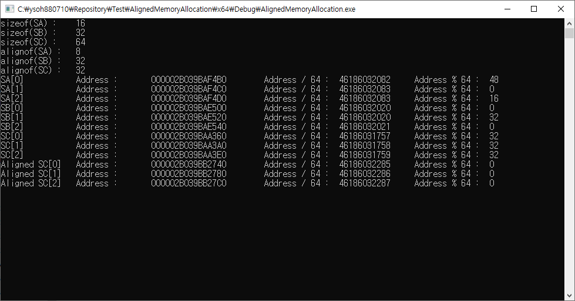

# Test-AlignedMemoryAllocation

## Environment

- Window 10 sdk 10.0.22000  
- Visual Studio 2019  
- ISO c++17  

## Result

In order to allocate aligned memory, use the functions below.
- _aligned_malloc()
- _aligned_free()

## Note

- alignas() does not guarantee memory alignment of dynamic allocation.
- https://stackoverflow.com/questions/15511909/does-the-alignas-specifier-work-with-new

